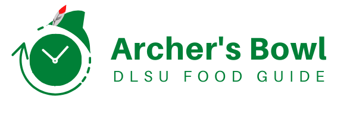
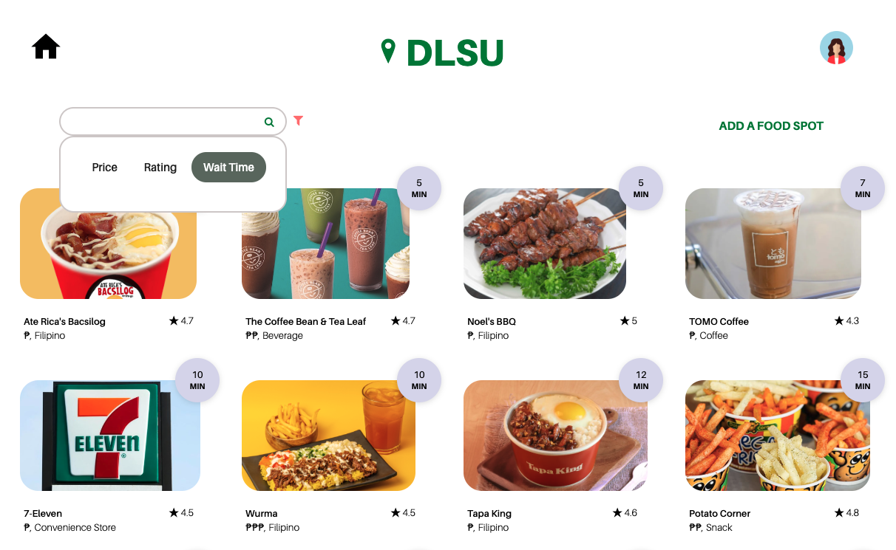

##
Indecisiveness in choosing where to eat next is a common frustration. There is an overwhelming amount of options for food spots in and around De La Salle University, yet information on these is limited or difficult to obtain on the go. This web application aims to answer a Lasallian’s question, “Where should we eat now?” Students unfamiliar with the campus can utilize the web application to add, view, and share each restaurant’s wait time, location, price, etc. This will ease a common frustration, discover new places, have a more efficient break time, and help underrated businesses.

This repository contains the files for this food forum web app called *Archer's Bowl*. The Lasallian community can create an account and log in to see all the nearby food spots in and around De La Salle, University. 

##



## Follow the steps below to set-up the repository locally:
1. Clone the repository or download the zipped folder.
2. Open the command prompt.
3. Navigate to the project folder.
4. Install the necessary NPM libraries by running `npm install`.
4. Make sure MongoDB is installed and running.
5. To run the application, execute `node index.js` or `npm start`.
6. Go to the browser and enter `localhost:3000` in the URL to access the web application.


**The application is currently deployed and can be found through this link: https://mco-phase-3-archersbowl.web.app/ or https://archers-bowl.herokuapp.com/**


The following npm commands were used when developing the program
```
npm init -y
npm i dotenv
npm i express
npm i mongoose
npm i url
npm i path
npm i express-handlebars
npm i nodemon (AUTO-RESTARTS SERVER WHENEVER CHANGES ARE SAVED)
npm i ejs (NOT INSTALLED)
npm i express-session (NOT INSTALLED)
npm i passport passport-local (NOT INSTALLED)
npm i passport-local-mongoose (NOT INSTALLED)
npm i hbs (NOT INSTALLED)
```

<sub> to use nodemon scripts run: PowerShell -ExecutionPolicy Bypass when starting a new terminal  <br>
clicking the user icon when already inside the user page will log you out and return the browser to the login page.  <br>
project not yet finished </sub>

## Contributors


